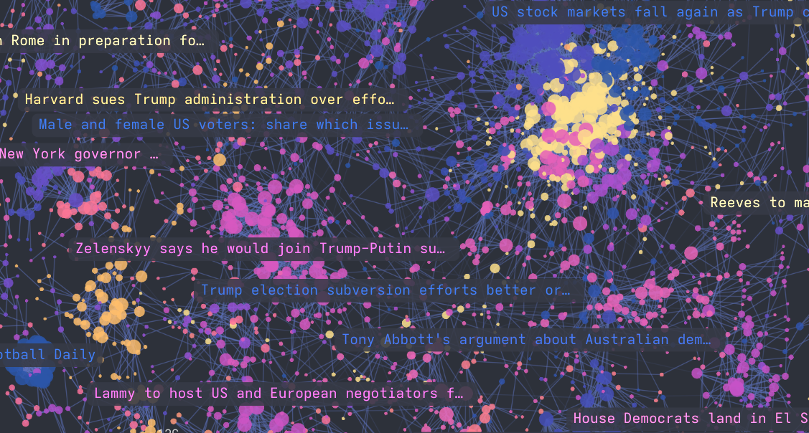

# Semnet: Graph structures from embeddings


_Embeddings of Guardian headlines represented as a network by Semnet and visualised in [Cosmograph](cosmograph.app)_


## Introduction
Semnet constructs graph structures from embeddings, enabling graph-based analysis and operations over collections of embedded documents.

Semnet uses [Annoy](https://github.com/spotify/annoy) to perform efficient pair-wise distance calculations, allowing for million-embedding network construction in under ten minutes on consumer hardware.

Graphs are returned as [NetworkX](https://networkx.org) objects, opening up a wide range of algorithms for downstream use.

## Use cases
The name "Semnet" derives from _[semantic network](https://en.wikipedia.org/wiki/Semantic_network)_[^1], as it was initially designed for an NLP use-case, but the tool will work well with any form of embedded document (e.g., images, audio, even or [graphs](https://arxiv.org/abs/1707.05005)).

[^1]: Technically-speaking a [Semantic Similarity Network (SSN)](https://en.wikipedia.org/wiki/Semantic_similarity_network)

Semnet may be used for:
- **Deduplication**: remove duplicate records (e.g., "Donald Trump", "Donald J. Trump) from datasets
- **Clustering**: find groups of similar documents via [community detection](https://networkx.org/documentation/stable/reference/algorithms/community.html) algorithms
- **Recommendation systems**: Account for relationships, and take advantage of graph structures such as communities and paths in search, RAG and context engineering
- **Knowledge graph construction**: Build networks of related concepts or entities, as a regular NetworkX graph it's easy to add additional entities
- **Exploratory data analysis and visualisation**, [Cosmograph](https://cosmograph.app/) works brilliantly for large corpora

Exposing the full NetworkX and Annoy APIs, Semnet offers plenty of opportunity for experimentation depending on your use-case. Check out the examples for inspiration.

## Quick Start

```python
from semnet import SemanticNetwork
from sentence_transformers import SentenceTransformer
import networkx as nx

# Your documents
docs = [
    "The cat sat on the mat",
    "A cat was sitting on a mat",
    "The dog ran in the park",
    "I love Python",
    "Python is a great programming language",
]

# Generate embeddings (use any embedding provider)
embedding_model = SentenceTransformer("BAAI/bge-base-en-v1.5")
embeddings = embedding_model.encode(docs)

# Create and configure semantic network
sem = SemanticNetwork(thresh=0.3, verbose=True)  # Larger values give sparser networks

# Build the semantic graph from your embeddings
G = sem.fit_transform(embeddings, labels=docs)

# Export to pandas
nodes, edges = sem.to_pandas(G)
```

## Overview

### What problem does Semnet solve?
Graph construction entails finding pairwise relationships (edges) between entities (nodes) in a dataset. 

For large corpora, scaling problems rapidly become apparent as the number of possible pairs in a set scales quadratically.

$$pairs = \frac{n(n-1)}{2}$$

### Naive approach
If we were to naively attempt to construct a graph from a modestly-sized set of documents using something like `itertools.combinations()` we rapidly run into problems.

Trying this out naively on my four-year-old gaming laptop required leaving it running overnight:

```python
n = 10000
pairs = n * (n - 1) // 2
print(f"Number of documents: {n:,}")
print(f"Number of possible pairs: {pairs:,}")

>> Number of documents: 10,000
>> Number of possible pairs: 49,995,000
```
That's around 50 million combinations to hit.

```python
# Embed a single text
text = "I feel the need, the need for speed"
embedding = embedding_model.encode([text])[0]

# Make 10,000 copies of the embedding with slight variations
variations = np.random.normal(size=(10_000, embedding.shape[0]))
embeddings = embedding + variations * 0.01

start_time = time.time()
for source, target in combinations(range(len(embeddings)), 2):
    source_embedding = embeddings[source].reshape(1, -1)
    target_embedding = embeddings[target].reshape(1, -1)
    sim = cosine_similarity(source_embedding, target_embedding)
end_time = time.time()
print(f"Processing time: {end_time - start_time:.2f} seconds")
```
This is completely unacceptable for any real world use case, and with quadratic scaling only gets worse as the corpus size increases.[^2]

[^2]: Big performance gains could naturally be achieved  parallelism, but at the time of writing, Semnet also only processes sequentially.

### With Semnet

Semnet solves this scaling problem using [Approximate Nearest Neighbours](https://en.wikipedia.org/wiki/Nearest_neighbor_search#Approximate_nearest_neighbor) search with [Annoy](https://github.com/spotify/annoy).

Instead of making comparisons between each document in the corpus, Semnet indexes the embeddings, iterates over each one, and returns a `top_k` best matches from within their neighbourhood.

Trying this again on the same rig with ten times the number of documents.

```python
# Kick off timer again
start_time = time.time()

# Make 100,000 copies this time
variations = np.random.normal(size=(100_000, embedding.shape[0]))
embeddings = embedding + variations * 0.01

# Build semantic network
semnet = SemanticNetwork(thresh=0.4, top_k=5)
G = semnet.fit_transform(embeddings)

# Close off the timer
end_time = time.time()
print(f"Processing time: {end_time - start_time:.2f} seconds")

>> Processing time: 35.96 seconds
```
Gone in ~30 seconds.

### Graph construction
Constructing a graph with all possible pairs and distances presents a second scaling challenge, this time in memory. 

A fully-connected graph with 10,000 nodes would also have ~50 million edges, making relatively simple algorithms challenging on consumer hardware.

Semnet provides two parameters during graph construction to address this problem:

#### `thresh`
The similarity threshold at which two nodes are considered to have an edge. Any pairs with a similarity lower than `thresh` are discarded.

`thresh` limits how similar two documents can be to be considered related.


`thresh` is the most important parameter in determining graph density, particularly at larger scales. 

Lower values will result in large numbers of increasingly tenuous connections (false positives), higher values will result in more false negatives and orphan nodes.

#### `top_k`
Passed to the `AnnoyIndex`, `top_k` limits the number of results returned during search, and thus the number of out-bound edges a single node may possess.

`top_k` limits the maximum number of connections a graph can have.


Higher values of `top_k` quickly result in heavily connected networks, but are strongly limited by `thresh`.

### Full connectivity
Distances provided by `annoy` are converted to similarity (`weight`) using `1 - distance`. A similarity of 1 will always be a perfect match, lower bounds may vary depending on the distance metric used, but for `angular` (cosine similarity), a `thresh` of -1 and `top_k = len(embeddings)` can be assumed to return a fully connect network. 

## Examples

### Visualisation
```python

# Export to pandas for visualisation with cosmograph 
nodes, edges = sem.to_pandas(G)

```
### Deduplication
Semnet was built as a by-product of a complex deduplication task: disambiguating structured LLM output from a large corpus.


```python
from sentence_transformers import SentenceTransformer
from semnet import SemanticNetwork
import networkx as nx
import matplotlib.pyplot as plt

docs = [
    "Tony Blair",
    "Anthony Blair",
    "Sir Tony Blair",
    "President Obama",
    "Barack Obama",
    "Donald J. Trump",
    "Donald Trump",
    "The Donald",
    "Joe Biden",
    "Joseph Biden",
    "Elon Musk",
]

embedding_model = SentenceTransformer("BAAI/bge-base-en-v1.5")
embeddings = embedding_model.encode(docs, show_progress_bar=True)
```

### Clustering

### Extending the graph


## What is a semantic network?
SUPER IMPORTANT BIT, PICK UP FROM HERE AFTER YOUR SECOND COFFEE IN THE MORNING!
### What are networks?


### Embeddings and cosine similarity
Embeddings provide a numerical representation of a document, e.g. a piece of text. 

```python
text = "the cat sat on the mat"
embedding = embedding_model.encode(text)

print(embedding)
>> [[-2.96685044e-02 -7.30926916e-02 -1.04720229e-02 ... ]]
```

Two documents that are similar will have similar embeddings. We can measure the similarity between embeddings in a number of ways, most typically through _cosine similarity_. More similar documents will have higher similarity.

```python
a = embedding_model.encode(['The cat sat on the mat'])
b = embedding_model.encode(['A cat sat on the mat'])
c = embedding_model.encode(['The mouse ate the cheese'])

# 'The cat sat on the mat' <> 'A cat sat on the mat'
print(cosine_similarity(a, b))
>> 0.989

# 'The cat sat on the mat' <> "The mouse ate the cheese'
print(cosine_similarity(a, c))
>> 0.455
```
### Networks
Networks (or graphs) are a data structure which models the relationships between two or more entities. They're used to model everything from epidemics to communications systems to [Hollywood actors](https://en.wikipedia.org/wiki/Six_Degrees_of_Kevin_Bacon). 


_By Userr999 - Own work, CC BY-SA 4.0, https://commons.wikimedia.org/w/index.php?curid=124350933_

We can use the similarity scores from the embeddings above to construct a _semantic network_

```python


```


## How it works


## Installation

```bash
pip install semnet
```

For development:

```bash
git clone https://github.com/specialprocedures/semnet.git
cd semnet
pip install -e ".[dev]"
```

## Performance Tips

- Use `"angular"` metric for cosine similarity (default and recommended)
- Increase `n_trees` for better accuracy (try 50-100 for large datasets)
- Decrease `top_k` if you have memory constraints
- Use smaller embedding models for speed: `"all-MiniLM-L6-v2"`
- Use larger models for accuracy: `"BAAI/bge-large-en-v1.5"`

## Requirements

- Python 3.8+
- networkx
- annoy
- numpy
- pandas
- tqdm

Recommended for examples:
- sentence-transformers
- cosmograph

## Project origin and statement on the use of AI

I love network analysis, and have explored embedding-derived [semantic networks](https://en.wikipedia.org/wiki/Semantic_network) in the past as an alternative approach to representing, clustering and querying news data. 

Whilst using semantic networks for graph analysis on some forthcoming research, I decided to package some of my code for others to use.

I kicked off the project by hand-refactoring my initial code into the class-based structure that forms the core functionality of the current module.

I then used Github Copilot in VSCode to:
- Bootstrap scaffolding, tests, documentation, examples and typing
- Refactor the core methods in the style of the scikit-learn API
- Add additional functionality, e.g., the ability to pass custom data to nodes
- Walk me through deployment to [readthedocs](https://semnetdocs.readthedocs.io/) and [pypi](https://pypi.org/project/semnet/)
## Roadmap

Semnet is a relatively simple project focused on core graph construction functionality. Potential future additions:
- Better examples showcasing network analysis on large corpora
- Integration with graph visualization tools
- Performance optimizations for very large datasets

## License

MIT License

## Citation

If you use Semnet in academic work, please cite:

```bibtex
@software{semnet,
  title={Semnet: Semantic Networks from Embeddings},
  author={Ian Goodrich},
  year={2025},
  url={https://github.com/specialprocedures/semnet}
}
```
