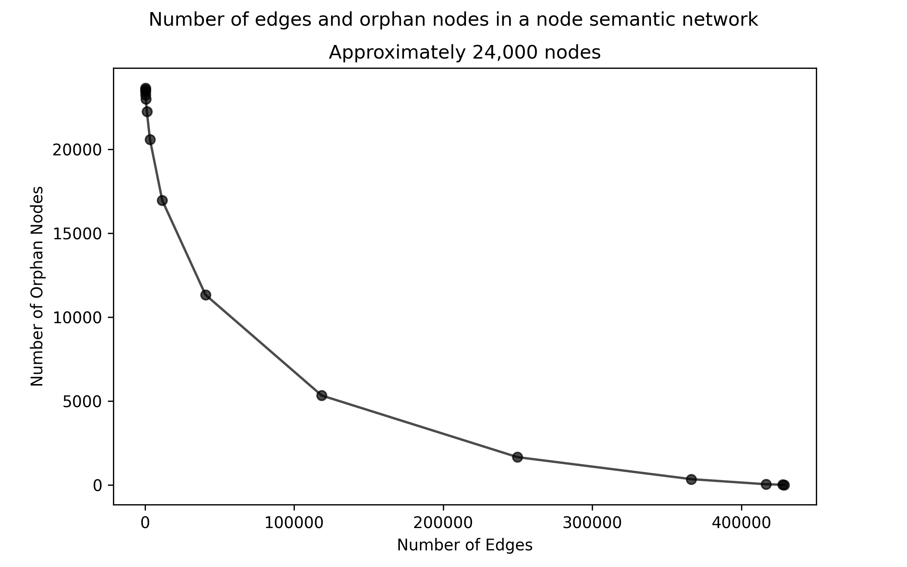
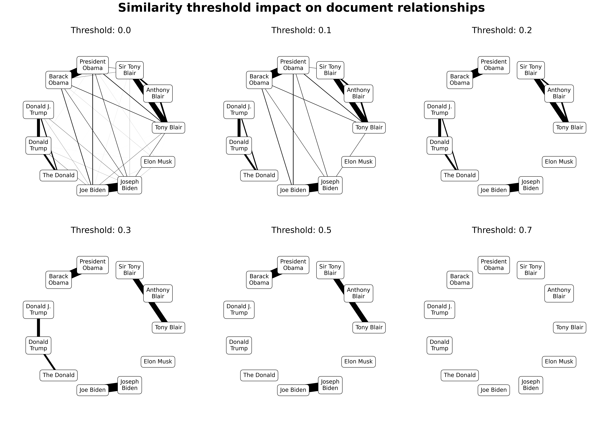
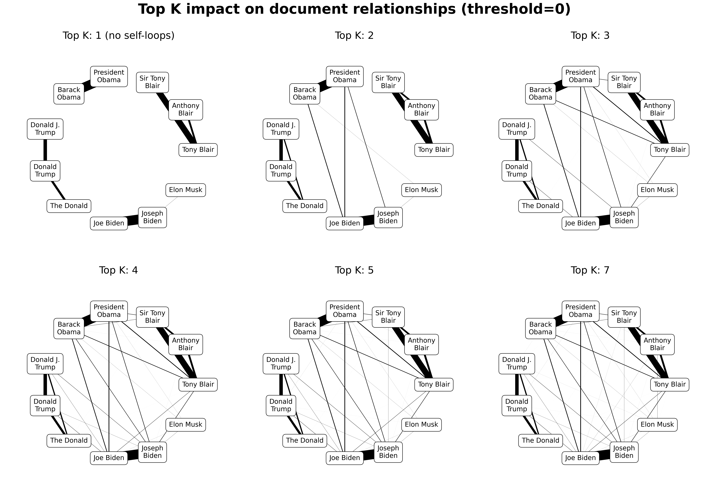
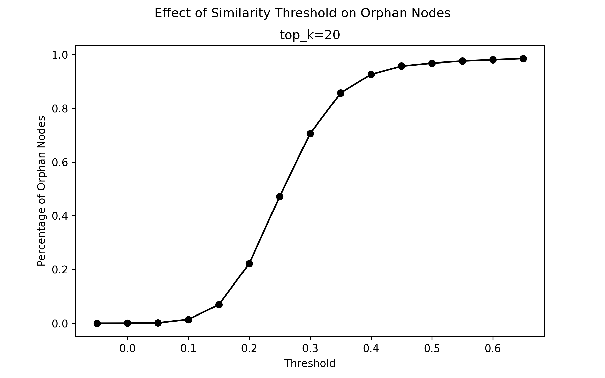

# Parameters

Constructing graphs in Semnet entails decision-making on graph density. This guide explores the trade-offs between sparse and dense networks, and describes the parameters used to control the final structure.

## Orphan nodes

Graphs constructed with Semnet will typically contain orphan nodes, that is, nodes that are not connected to any other nodes. They may also contain small disconnected components, i.e., nodes that are only connected to a small group of other nodes.

### Why do orphan nodes occur?

Semnet constructs graphs by comparing the similarity of two entities, if a similarity threshold is reached, then the entities are considered to have an edge.

To do this efficiently, Semnet indexes all possible candidates and returns a subset of those candidates for inclusion.

If for any given node, no matches are found above the threshold, then it will be added to the graph as an orphan.

### Are orphan nodes a problem?

Orphan nodes are not always problematic, they can be useful in themselves, for example for deduplication or outlier-detection.

Orphan nodes become a problem when we want to use a graph algorithm across all items in the dataset. Such algorithms often examine a nodes' position within a larger structure (e.g., for centrality measures). Unconnected nodes are also unavailable for path-finding, and will also return a community of one during community identification.

### How do we deal with them?

In an existing graph, the easiest way to deal with disconnected nodes is to remove them from the graph entirely.

For some use-cases, this isn't a problem. I do a lot of media analysis and I'm particularly interested in narratives. I'm often very happy with a smaller, more focussed network that only contains the most important messages.

For other use-cases, where it's imperative that all entities are accounted for, orphan nodes may be more problematic. In such cases, we will first try and construct our graph in a way that minimises orphan nodes whilst maintaining coherence and performance.

### Density and orphan nodes

The number of orphan nodes in a graph is a function of its density. A more tightly connected (high-edge count) graph will have fewer orphans than a dense one.

Unfortunately, it's rare that we can simply maximise connectivity. Graphs with millions of edges are constrained by memory problems, and in the context of a similarity network will also contain spurious connections at lower similarities.

### Controlling density

Semnet exposes two parameters which provide us with the ability to influence the density of the final graph: `thresh` and `top_k`.

### `thresh`

`thresh` is the similarity threshold at which two nodes are considered to have an edge. Any pairs with a similarity lower than `thresh` are discarded.

`thresh` is the most important parameter in determining graph density, particularly at larger scales.

Lower values will result in large numbers of increasingly tenuous connections (false positives), higher values will result in more false negatives and orphan nodes.

In practice, I've found values between 0.1 and 0.4 to work well for most use cases, depending on the corpus.

### `top_k`

Passed to the `AnnoyIndex`, `top_k` limits the number of results returned during search, and thus the number of out-bound edges a single node may possess.

`top_k` limits the maximum number of connections a graph can have.

Higher values of `top_k` quickly result in heavily connected networks, but are strongly limited by `thresh`.

### Setting values

The number of orphan nodes in a graph at a constant `top_k` approximates a sigmoid function of `thresh`.

## Dealing with orphan nodes and small disconnected

In the context of a semantic network, disconnected nodes can be treated as outliers. As with other forms of analysis, how we deal with disconnected components will vary depending on our use case.

There are several possible strategies for managing disconnected components:

- Try and build the whole graph again with a lower threshold, accepting more tenuous links
- Attempt to connect the disconnected nodes at a lower threshold
- Connect the graph by adding additional nodes and edges for other attributes, e.g., author
- Drop everything but the largest subgraph
- Drop selectively, keeping some smaller subgraphs
- Keep them in, selectively excluding them where relevant (e.g., with community identification)

## Performance

`top_k` is passed to `Annoy` during search and affects performance. Higher values will take longer to run, given the larger search space required.

`n_trees` is also passed to `Annoy`, and impacts how the index is constructed. A higher value will result in a larger, more accurate index, but also in slower search times and greater memory use.
